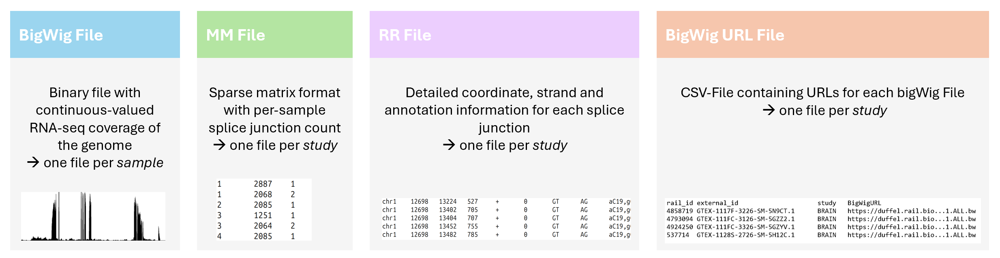
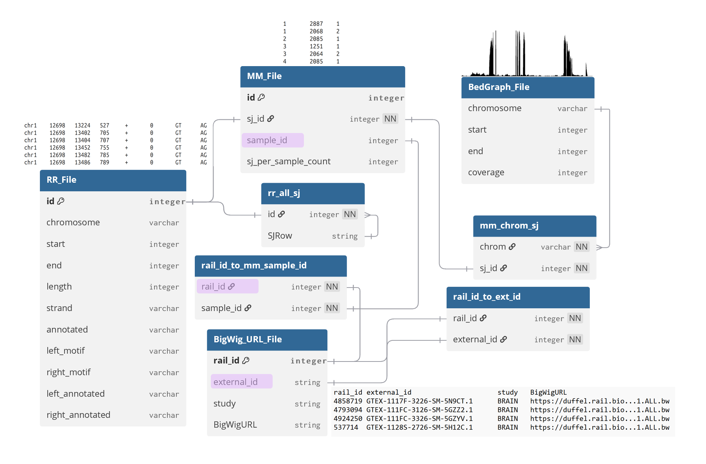
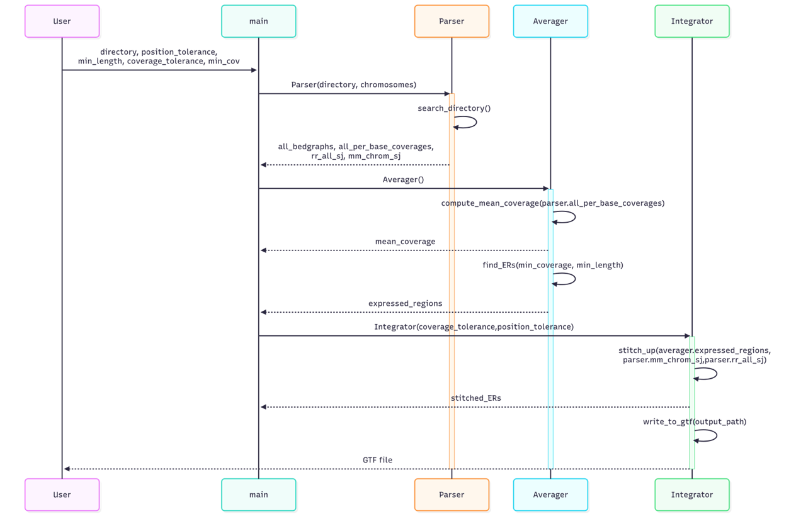
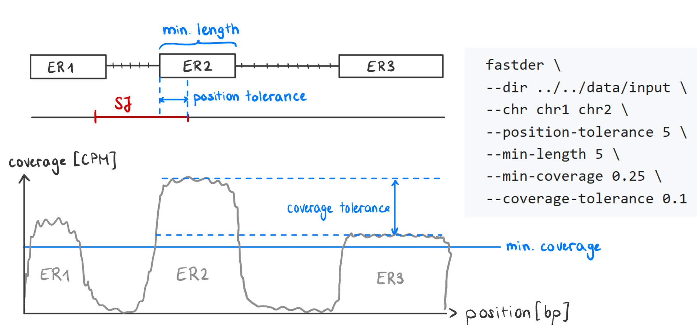

# _fastder_  
`fastder` is a C++ based tool for detecting expressed regions in RNA-seq data. 
It is intended to build on the `recount3` [resource](https://rna.recount.bio/), which consists of over 750'000 uniformly processed RNA-seq samples across different mouse and human studies.
The tool aims to reconstruct expressed genes prior to splicing in an annotation-agnostic approach.

`fastder` takes genome-wide coverage files and splice junction coordinates as input. Coverage can be supplied as BedGraph by default, or as BigWig when the build was configured with `-DFASTDER_USE_LIBBIGWIG=ON`. The tool averages across samples and applies a coverage threshold to identify consecutive regions with above-threshold expression. It then stitches expressed regions (ERs) together when a splice junction in the input matches the end of one ER and the start of the next.

Coverage is held in memory as a sparse list of intervals rather than a dense per-base vector. On chr21 this keeps the resident set in the low hundreds of MB instead of multiple GB at full hg38. Splice junctions are partitioned by strand at the Integrator: each chromosome's expressed regions are walked once per strand, and chains built from junction-linked ERs are tagged `+` or `-`. Standalone ERs that no junction connected to a neighbour stay unstranded (`.`).


## Building

The default build needs cmake (4.0 or newer) and a C++20 compiler:

```
mkdir build
cd build
cmake ..
make -j
```

To read BigWig coverage directly instead of converting to BedGraph first,
configure with `-DFASTDER_USE_LIBBIGWIG=ON`. CMake will fetch libBigWig from
GitHub at configure time. zlib and libcurl headers must be available.

```
cmake -DFASTDER_USE_LIBBIGWIG=ON ..
```

The unit tests run with `ctest` from the build directory. Two tests are gated
on the libBigWig option and are skipped in the default build.

## Installation

### Recount3 Background
`recount3` provides RNA-seq data for over 8'000 human and over 10'000 mouse studies. Each study consist of multiple _per-sample_ 
coverage bigWig files and one set of *per-study* splice junction coordinate files amongst others.
These datasets can be downloaded from their [online platform](https://jhubiostatistics.shinyapps.io/recount3-study-explorer/). 
Thus, the user can either provide data from one of the existing studies or run the `recount3` pipeline with new RNA-seq data.


## Input data

`recount3` provides uniformly processed RNA-seq data for over 8'000 human and over 10'000 mouse studies. Each study consists of several thousand samples. Existing input files can be retrieved from the [recount3 online platform](https://jhubiostatistics.shinyapps.io/recount3-study-explorer/).
If a user wishes to run `fastder` on new RNA-seq data, the easiest way to obtain the required input data is to run the `recount3` pipeline.




### Recount3 Pipeline
`fastder` builds on the `Monorail` pipeline used by `recount3`. `Monorail` takes the FASTQ files provided by Illumina Sequencing as an input.
A brief summary of the relevant steps in the `Monorail` pipeline (used to create `recount3` resources) is provided below:

1. Input data: 
   1. unpaired or paired-end FASTQ files
   2. suffix-array-based index of reference genome sequence

2. Perform spliced alignment with STAR to obtain 
   1. a BAM file with the spliced alignment
   2. a summary of detected splice junction

3. Use Megadepth to produce _bigWig coverage files_
4. Aggregate SJ.out.tab into a
   1. _MM file_
   2. _RR file_

## Code Structure

### Relational Database Model
The following diagram provides an overview of the tables and objects used in `fastder`. The _File suffix indicates that the table is one of the input files. 
All other tables are objects created by the `Parser` class to map between the three different sample IDs (in lilac) used by the splice junction and coverage files respectively.



### Sequence Diagram
The following sequence diagram provides an abstracted overview of the three main functional stages of `fastder`.


## Usage

`fastder` can currently take only one RR and MM file as an input. Thus, users directly working with
`recount3` resources can only provide samples from the same study as an input. 

- `fastder` expects all input files to be in the same folder (provided as a relative path to the build directory with `--dir`). 
- `fastder` allows users to optionally specify which chromosomes they wish to analyze. The flag `--chr <chr1>` means 
that the tool will only output expressed regions on chromosome 1, and will ignore all coverage and splice junction information from other chromosomes). 
- `fastder` allows optionally specifying four different thresholds:
  -  `--min-coverage 0.25` describes the coverage threshold of an expressed region (ER). 
  A consecutive base-pair position must have at least 0.25 CPM coverage to be added to en ER.
  - `--min-length 5` describes the minimum length (in bp) that an ER must have. For instance, three consecutive base pairs with coverage > 0.25 CPM will be ignored if the min length is set to 5 bp.
  - `--position-tolerance 5` describes the maximum permitted offset of the end position of an exon and the starting position of a splice junction. If this tolerance is set to 5,
  an ER with end position = 1000 bp and a splice junction with start position = 1005 bp will be stitched together (if the coverage and end junction match).
  - `--coverage-tolerance 1000` describes the permitted coverage deviation between two ERs separated by a spliced region. It defaults to 1000, effectively off, so stitching is driven by splice junctions rather than coverage similarity.

A visualization of the different parameters is provided below.


```
Usage:
   fastder \
      --dir <path> ... \
      [--chr <chr1> <chr2> ...] \
      [--min-coverage <float>] \
      [--min-length <int>] \
      [--position-tolerance <int>] \
      [--coverage-tolerance <float>] \
      [--cores <int>]

Required inputs:

   --dir <path> ...                             Relative path from the build directory, or an absolute path, to the directory containing the input files.
                                                Example: --dir ../../data/test_exon_skipping

Optional inputs:

   --chr <chr1> <chr2> ...                      List of chromosomes to process.
                                                Default: all (chr1-chr22, chrX)
                                                Example: --chr chr1 chr2 chr3
                                                
   --min-length <int>                           Minimum length [#bp] required for a region to qualify as an expressed region (ER).
                                                Default: 10 bp
                                                Example: --min-length 10
                                                
   --min-coverage <float>                       Minimum coverage [CPM] required for a region to qualify as an ER.
                                                Normalized in-place by library size.
                                                Default: 0.05 CPM
                                                Example: --min-coverage 0.25
   
   --position-tolerance <int>                   Maximum allowed positional deviation between splice junction and ER coordinates [bp].
                                                Default: 5 bp
                                                Example: --position-tolerance 5
   
   --coverage-tolerance <float>                 Permitted coverage deviation between stitched ERs, as a proportion of the running average.
                                                Default: 1000 (gate effectively off; stitching is junction-driven).
                                                Example: --coverage-tolerance 2.0
   
   --cores <int>                                Number of cores fastder may use.
                                                Default: 10
                                                Example: --cores 23
   

Example:
   
   fastder \
   --dir ../../data/input \
   --chr chr1 chr2 \
   --position-tolerance 5 \
   --min-length 10 \
   --min-coverage 0.05 \
   --cores 10
```


## License

GPLv3

## Contact

martina.lavanya@gmail.com
